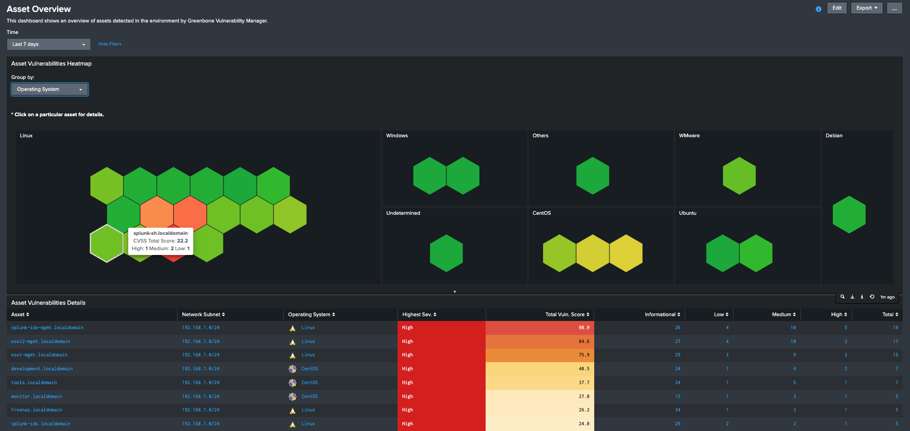

`splunk_app_gvm`

# Greenbone Vulnerability Manager (formerly OpenVAS) App for Splunk

## Description

This Splunk application was created to provide insight into Vulnerability Management Data provided by the [Greenbone Vulnerability Manager Add-on for Splunk](https://github.com/ccloutier-splunk/TA-gvm).

## What is it ?

It's a Splunk application that provides dashboards that enable a user of Greenbone Vulnerability Manager to have better view of the assets, vulnerabilities, potential mitigations and certificates seen in their environment.

## Compatibility

The current version of this app is compatible with:

- Splunk 8.x.x, 9.x.x

## Installation & Configuration

In order to use this application:

- Ensure that the relevant data is being ingested via the [Greenbone Vulnerability Manager Add-on for Splunk](https://github.com/ccloutier-splunk/TA-gvm) and make a note of the index used (a separate index, e.g.: `vuln` is recommended!)
- Install any dependencies (see below).
- Install the application to your Splunk Search Head(s):

	**Install on a single instance**

	If your Splunk Enterprise deployment is a single instance, install both the app and the add-on to your single instance. You can use the Install app from file feature in the Manage Apps page in Splunk Web to install both packages, or install manually using the command line.

	After you install the app and add-on, create indexes the app uses to report on preconfigured saved searches. For more information, see Create indexes and schedule saved searches.

	**Install in a non-clustered distributed environment**

	If your Splunk Enterprise deployment is distributed and non-clustered, follow these steps:

	+ If you are installing to one or more independent search heads, follow your preferred method of deploying the app. You can do any of the following:

		* Follow the Install app from file wizard on the Manage Apps screen in Splunk Web.
		* Install manually using the command line.
		* Use a deployment server to deploy the unconfigured packages to your search heads. Do not configure the app prior to deploying it.

	**Install in a clustered distributed environment**

	If your Splunk Enterprise deployment has one or more search head cluster(s), use the [Deployer](https://docs.splunk.com/Documentation/Splunk/latest/DistSearch/PropagateSHCconfigurationchanges) to deploy the app to your cluster(s).

- Update the `gvm_index` macro under **Settings, Advanced Search, Search Macros** to reflect the index which contains the **Greenbone Vulnerability Manager** data as per your add-on configuration.

## Dependencies

The following dependencies are required by the dashboards in this application:

- [Dendrogram Viz](https://splunkbase.splunk.com/app/5153/)
- [Heat Grid Viz](https://splunkbase.splunk.com/app/5541/)
- [Sankey Diagram - Custom Visualization](https://splunkbase.splunk.com/app/3112/)

## What does it look like?

The application provides the following insights/dashboards:

The main **Vulnerability Manager Overview** dashboard gives the user a bird's eye view of the environment vulnerabiltiy posture.  It show vulnerabilities by severity, the history of scan results as well as critical CVEs detected, details on assets and certificates and finally allows the user to drilldown to any of these areas for more details.

The **Asset Overview** dashboard gives the user an overall view of the different assets detected within the environment, grouped by operating system, highest severity or network subnet.  This enables finding 
the most vulnerable assets very quickly.  The user can then drilldown to any of the assets for further details.

The **Asset Details** dashboard gives the user full vulnerability details around a selected asset as well as detected applications, hardware and operating system as applicable.  Any of the asset vulnerabilities can be clicked for more details including the vulnerability's full description as well as details around fixing or mitigating it when available.

The **Asset Services & Ports** provides insight into services and ports exposed within the environment in general or specific to a particular asset or port.

The **Certificate Overview** dashboard provides insight into the SSL/TLS Certificates used within the environment for various services, including clear relationship between hosts, services, ports and certicates as well as the status of each certificate, allowing you to easily see which ones have or are close to being expired.  It's then trivial to setup an alert for any certificates about to expire.

## Feedback

If you have feedback on this Splunk app (improvement ideas, issues, questions), feel free to contact me via email or open an issue on this project on GitHub.

## Credits

> Background image for the Main Overview Dashboard by [Pietro Jeng](https://unsplash.com/@pietrozj?utm_source=unsplash&utm_medium=referral&utm_content=creditCopyText) on [Unsplash](https://unsplash.com/collections/17065994/abstract-tech?utm_source=unsplash&utm_medium=referral&utm_content=creditCopyText).
